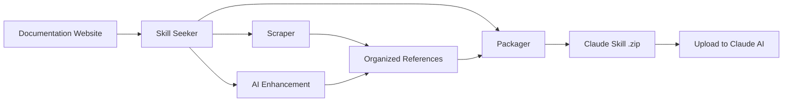

# Skill Seeker

[](https://opensource.org/licenses/MIT)
[](https://www.python.org/downloads/)

**Automatically convert any documentation website into a Claude AI skill in minutes.**

## What is Skill Seeker?

Skill Seeker is an automated tool that transforms any documentation website into a production-ready [Claude AI skill](https://claude.ai). Instead of manually reading and summarizing documentation, Skill Seeker:

1. **Scrapes** documentation websites automatically
2. **Organizes** content into categorized reference files
3. **Enhances** with AI to extract best examples and key concepts
4. **Packages** everything into an uploadable `.zip` file for Claude

**Result:** Get comprehensive Claude skills for any framework, API, or tool in 20-40 minutes instead of hours of manual work.

## Why Use This?

- 🎯 **For Developers**: Quickly create Claude skills for your favorite frameworks (React, Vue, Django, etc.)
- 🎮 **For Game Devs**: Generate skills for game engines (Godot, Unity documentation, etc.)
- 🔧 **For Teams**: Create internal documentation skills for your company's APIs
- 📚 **For Learners**: Build comprehensive reference skills for technologies you're learning

## Key Features

✅ **Universal Scraper** - Works with ANY documentation website
✅ **AI-Powered Enhancement** - Transforms basic templates into comprehensive guides
✅ **8 Ready-to-Use Presets** - Godot, React, Vue, Django, FastAPI, and more
✅ **Smart Categorization** - Automatically organizes content by topic
✅ **Code Language Detection** - Recognizes Python, JavaScript, C++, GDScript, etc.
✅ **No API Costs** - FREE local enhancement using Claude Code Max
✅ **Caching System** - Scrape once, rebuild instantly

## Quick Example

```bash
# Install dependencies (2 pip packages)
pip3 install requests beautifulsoup4

# Generate a React skill in one command
python3 doc_scraper.py --config configs/react.json --enhance-local

# Upload output/react.zip to Claude - Done!
```

**Time:** ~25 minutes | **Quality:** Production-ready | **Cost:** Free

## How It Works



1. **Scrape**: Extracts all pages from documentation
2. **Categorize**: Organizes content into topics (API, guides, tutorials, etc.)
3. **Enhance**: AI analyzes docs and creates comprehensive SKILL.md with examples
4. **Package**: Bundles everything into a Claude-ready `.zip` file

## 🚀 Quick Start

### Easiest: Use a Preset

```bash
# Install dependencies (macOS)
pip3 install requests beautifulsoup4

# Use Godot preset
python3 doc_scraper.py --config configs/godot.json

# Use React preset
python3 doc_scraper.py --config configs/react.json

# See all presets
ls configs/
```

### Interactive Mode

```bash
python3 doc_scraper.py --interactive
```

### Quick Mode

```bash
python3 doc_scraper.py \
  --name react \
  --url https://react.dev/ \
  --description "React framework for UIs"
```

## 📁 Simple Structure

```
doc-to-skill/
├── doc_scraper.py          # Main scraping tool
├── enhance_skill.py        # Optional: AI-powered SKILL.md enhancement
├── configs/                # Preset configurations
│   ├── godot.json         # Godot Engine
│   ├── react.json         # React
│   ├── vue.json           # Vue.js
│   ├── django.json        # Django
│   └── fastapi.json       # FastAPI
└── output/                 # All output (auto-created)
    ├── godot_data/        # Scraped data
    └── godot/             # Built skill
```

## ✨ Features

### 1. Auto-Detect Existing Data

```bash
python3 doc_scraper.py --config configs/godot.json

# If data exists:
✓ Found existing data: 245 pages
Use existing data? (y/n): y
⏭️  Skipping scrape, using existing data
```

### 2. Knowledge Generation

**Automatic pattern extraction:**
- Extracts common code patterns from docs
- Detects programming language
- Creates quick reference with real examples
- Smarter categorization with scoring

**Enhanced SKILL.md:**
- Real code examples from documentation
- Language-annotated code blocks
- Common patterns section
- Quick reference from actual usage examples

### 3. Smart Categorization

Automatically infers categories from:
- URL structure
- Page titles
- Content keywords
- With scoring for better accuracy

### 4. Code Language Detection

```python
# Automatically detects:
- Python (def, import, from)
- JavaScript (const, let, =>)
- GDScript (func, var, extends)
- C++ (#include, int main)
- And more...
```

### 5. Skip Scraping

```bash
# Scrape once
python3 doc_scraper.py --config configs/react.json

# Later, just rebuild (instant)
python3 doc_scraper.py --config configs/react.json --skip-scrape
```

### 6. AI-Powered SKILL.md Enhancement (NEW!)

```bash
# Option 1: During scraping (API-based, requires API key)
pip3 install anthropic
export ANTHROPIC_API_KEY=sk-ant-...
python3 doc_scraper.py --config configs/react.json --enhance

# Option 2: During scraping (LOCAL, no API key - uses Claude Code Max)
python3 doc_scraper.py --config configs/react.json --enhance-local

# Option 3: After scraping (API-based, standalone)
python3 enhance_skill.py output/react/

# Option 4: After scraping (LOCAL, no API key, standalone)
python3 enhance_skill_local.py output/react/
```

**What it does:**
- Reads your reference documentation
- Uses Claude to generate an excellent SKILL.md
- Extracts best code examples (5-10 practical examples)
- Creates comprehensive quick reference
- Adds domain-specific key concepts
- Provides navigation guidance for different skill levels
- Automatically backs up original
- **Quality:** Transforms 75-line templates into 500+ line comprehensive guides

**LOCAL Enhancement (Recommended):**
- Uses your Claude Code Max plan (no API costs)
- Opens new terminal with Claude Code
- Analyzes reference files automatically
- Takes 30-60 seconds
- Quality: 9/10 (comparable to API version)

## 🎯 Complete Workflows

### First Time (With Scraping + Enhancement)

```bash
# 1. Scrape + Build + AI Enhancement (LOCAL, no API key)
python3 doc_scraper.py --config configs/godot.json --enhance-local

# 2. Wait for new terminal to close (enhancement completes)
# Check the enhanced SKILL.md:
cat output/godot/SKILL.md

# 3. Package
python3 package_skill.py output/godot/

# 4. Done! You have godot.zip with excellent SKILL.md
```

**Time:** 20-40 minutes (scraping) + 60 seconds (enhancement) = ~21-41 minutes

### Using Existing Data (Fast!)

```bash
# 1. Use cached data + Local Enhancement
python3 doc_scraper.py --config configs/godot.json --skip-scrape
python3 enhance_skill_local.py output/godot/

# 2. Package
python3 package_skill.py output/godot/

# 3. Done!
```

**Time:** 1-3 minutes (build) + 60 seconds (enhancement) = ~2-4 minutes total

### Without Enhancement (Basic)

```bash
# 1. Scrape + Build (no enhancement)
python3 doc_scraper.py --config configs/godot.json

# 2. Package
python3 package_skill.py output/godot/

# 3. Done! (SKILL.md will be basic template)
```

**Time:** 20-40 minutes
**Note:** SKILL.md will be generic - enhancement strongly recommended!

## 📋 Available Presets

| Config | Framework | Description |
|--------|-----------|-------------|
| `godot.json` | Godot Engine | Game development |
| `react.json` | React | UI framework |
| `vue.json` | Vue.js | Progressive framework |
| `django.json` | Django | Python web framework |
| `fastapi.json` | FastAPI | Modern Python API |

### Using Presets

```bash
# Godot
python3 doc_scraper.py --config configs/godot.json

# React
python3 doc_scraper.py --config configs/react.json

# Vue
python3 doc_scraper.py --config configs/vue.json

# Django
python3 doc_scraper.py --config configs/django.json

# FastAPI
python3 doc_scraper.py --config configs/fastapi.json
```

## 🎨 Creating Your Own Config

### Option 1: Interactive

```bash
python3 doc_scraper.py --interactive
# Follow prompts, it will create the config for you
```

### Option 2: Copy and Edit

```bash
# Copy a preset
cp configs/react.json configs/myframework.json

# Edit it
nano configs/myframework.json

# Use it
python3 doc_scraper.py --config configs/myframework.json
```

### Config Structure

```json
{
  "name": "myframework",
  "description": "When to use this skill",
  "base_url": "https://docs.myframework.com/",
  "selectors": {
    "main_content": "article",
    "title": "h1",
    "code_blocks": "pre code"
  },
  "url_patterns": {
    "include": ["/docs", "/guide"],
    "exclude": ["/blog", "/about"]
  },
  "categories": {
    "getting_started": ["intro", "quickstart"],
    "api": ["api", "reference"]
  },
  "rate_limit": 0.5,
  "max_pages": 500
}
```

## 📊 What Gets Created

```
output/
├── godot_data/              # Scraped raw data
│   ├── pages/              # JSON files (one per page)
│   └── summary.json        # Overview
│
└── godot/                   # The skill
    ├── SKILL.md            # Enhanced with real examples
    ├── references/         # Categorized docs
    │   ├── index.md
    │   ├── getting_started.md
    │   ├── scripting.md
    │   └── ...
    ├── scripts/            # Empty (add your own)
    └── assets/             # Empty (add your own)
```

## 🎯 Command Line Options

```bash
# Interactive mode
python3 doc_scraper.py --interactive

# Use config file
python3 doc_scraper.py --config configs/godot.json

# Quick mode
python3 doc_scraper.py --name react --url https://react.dev/

# Skip scraping (use existing data)
python3 doc_scraper.py --config configs/godot.json --skip-scrape

# With description
python3 doc_scraper.py \
  --name react \
  --url https://react.dev/ \
  --description "React framework for building UIs"
```

## 💡 Tips

### 1. Test Small First

Edit `max_pages` in config to test:
```json
{
  "max_pages": 20  // Test with just 20 pages
}
```

### 2. Reuse Scraped Data

```bash
# Scrape once
python3 doc_scraper.py --config configs/react.json

# Rebuild multiple times (instant)
python3 doc_scraper.py --config configs/react.json --skip-scrape
python3 doc_scraper.py --config configs/react.json --skip-scrape
```

### 3. Finding Selectors

```python
# Test in Python
from bs4 import BeautifulSoup
import requests

url = "https://docs.example.com/page"
soup = BeautifulSoup(requests.get(url).content, 'html.parser')

# Try different selectors
print(soup.select_one('article'))
print(soup.select_one('main'))
print(soup.select_one('div[role="main"]'))
```

### 4. Check Output Quality

```bash
# After building, check:
cat output/godot/SKILL.md  # Should have real examples
cat output/godot/references/index.md  # Categories
```

## 🐛 Troubleshooting

### No Content Extracted?
- Check your `main_content` selector
- Try: `article`, `main`, `div[role="main"]`

### Data Exists But Won't Use It?
```bash
# Force re-scrape
rm -rf output/myframework_data/
python3 doc_scraper.py --config configs/myframework.json
```

### Categories Not Good?
Edit the config `categories` section with better keywords.

### Want to Update Docs?
```bash
# Delete old data
rm -rf output/godot_data/

# Re-scrape
python3 doc_scraper.py --config configs/godot.json
```

## 📈 Performance

| Task | Time | Notes |
|------|------|-------|
| Scraping | 15-45 min | First time only |
| Building | 1-3 min | Fast! |
| Re-building | <1 min | With --skip-scrape |
| Packaging | 5-10 sec | Final zip |

## ✅ Summary

**One tool does everything:**
1. ✅ Scrapes documentation
2. ✅ Auto-detects existing data
3. ✅ Generates better knowledge
4. ✅ Creates enhanced skills
5. ✅ Works with presets or custom configs
6. ✅ Supports skip-scraping for fast iteration

**Simple structure:**
- `doc_scraper.py` - The tool
- `configs/` - Presets
- `output/` - Everything else

**Better output:**
- Real code examples with language detection
- Common patterns extracted from docs
- Smart categorization
- Enhanced SKILL.md with actual examples

## 📚 Documentation

- **[QUICKSTART.md](QUICKSTART.md)** - Get started in 3 steps
- **[docs/ENHANCEMENT.md](docs/ENHANCEMENT.md)** - AI enhancement guide
- **[docs/UPLOAD_GUIDE.md](docs/UPLOAD_GUIDE.md)** - How to upload skills to Claude
- **[docs/CLAUDE.md](docs/CLAUDE.md)** - Technical architecture
- **[STRUCTURE.md](STRUCTURE.md)** - Repository structure

## 🎮 Ready?

```bash
# Try Godot
python3 doc_scraper.py --config configs/godot.json

# Try React
python3 doc_scraper.py --config configs/react.json

# Or go interactive
python3 doc_scraper.py --interactive
```

## 🙏 Acknowledgements

This project builds upon the original [Skill Seekers](https://github.com/yusufkaraaslan/Skill_Seekers) by [Yusuf Karaaslan](https://github.com/yusufkaraaslan). Special thanks for the foundational work that made this possible.

## 📝 License

MIT License - see [LICENSE](LICENSE) file for details

---

Happy skill building! 🚀
